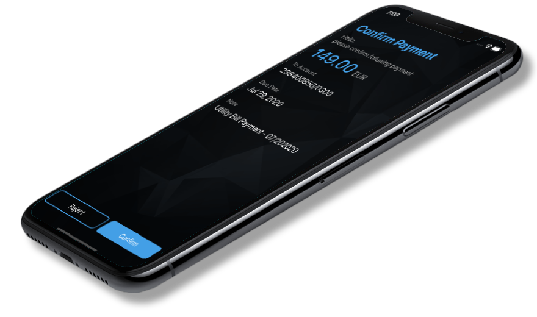

# Wultra Mobile Token SDK for iOS

<!-- begin remove -->

 

 
 
 
 
  

__Wultra Mobile Token SDK__ is a high-level SDK for operation approval.

## Introduction
 
<!-- begin remove -->

<!-- end -->
 
With Wultra Mobile Token (WMT) SDK, you can integrate an out-of-band operation approval into an existing mobile app, instead of using a standalone mobile token application. WMT is built on top of [PowerAuth Mobile SDK](https://github.com/wultra/powerauth-mobile-sdk). It communicates with the "Mobile Token API". Individual endpoints are described in the [PowerAuth Webflow documentation](https://developers.wultra.com/components/enrollment-server/develop/documentation/Mobile-Token-API).

To understand the Wultra Mobile Token SDK purpose on a business level better, you can visit our own [Mobile Token application](https://www.wultra.com/mobile-token). We use Wultra Mobile Token SDK in our mobile token application as well.

WMT SDK library does precisely this:

- Retrieves the list of operations that are pending approval for a given user.
- Approves or rejects operations with PowerAuth transaction signing.
- Registers an existing PowerAuth activation to receive push notifications.

Remarks:

- This library does not contain any UI.
- We also provide an [Android version of this library](https://github.com/wultra/mtoken-sdk-android). 

## Documentation

The documentation is available at the [Wultra Developer Portal](https://developers.wultra.com/components/mtoken-sdk-ios) or inside the [docs folder](docs).

## License

All sources are licensed using the Apache 2.0 license. You can use them with no restrictions. If you are using this library, please let us know. We will be happy to share and promote your project.

## Contact

If you need any assistance, do not hesitate to drop us a line at [hello@wultra.com](mailto:hello@wultra.com) or our official [wultra.com/discord](https://wultra.com/discord) channel.

### Security Disclosure

If you believe you have identified a security vulnerability with Wultra Mobile Token SDK, you should report it as soon as possible via email to [support@wultra.com](mailto:support@wultra.com). Please do not post it to a public issue tracker.
